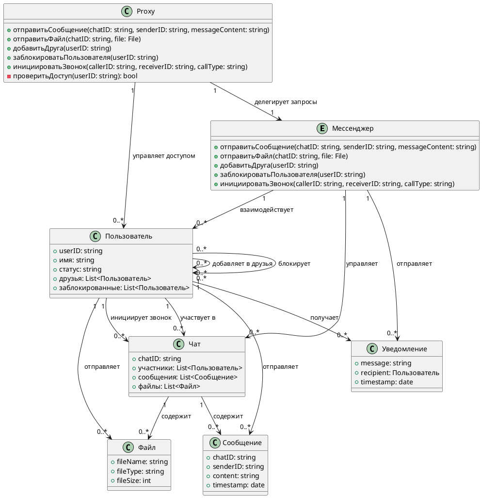

```plantuml
@startuml
entity Мессенджер {
    + отправитьСообщение(chatID: string, senderID: string, messageContent: string)
    + отправитьФайл(chatID: string, file: File)
    + добавитьДруга(userID: string)
    + заблокироватьПользователя(userID: string)
    + инициироватьЗвонок(callerID: string, receiverID: string, callType: string)
}

class Proxy {
    + отправитьСообщение(chatID: string, senderID: string, messageContent: string)
    + отправитьФайл(chatID: string, file: File)
    + добавитьДруга(userID: string)
    + заблокироватьПользователя(userID: string)
    + инициироватьЗвонок(callerID: string, receiverID: string, callType: string)
    - проверитьДоступ(userID: string): bool
}

class Сообщение {
    + chatID: string
    + senderID: string
    + content: string
    + timestamp: date
}

class Файл {
    + fileName: string
    + fileType: string
    + fileSize: int
}

class Пользователь {
    + userID: string
    + имя: string
    + статус: string
    + друзья: List<Пользователь>
    + заблокированные: List<Пользователь>
}

class Чат {
    + chatID: string
    + участники: List<Пользователь>
    + сообщения: List<Сообщение>
    + файлы: List<Файл>
}

class Уведомление {
    + message: string
    + recipient: Пользователь
    + timestamp: date
}

Мессенджер "1" --> "0..*" Чат : управляет
Мессенджер "1" --> "0..*" Пользователь : взаимодействует
Мессенджер "1" --> "0..*" Уведомление : отправляет

Proxy "1" --> "1" Мессенджер : делегирует запросы
Proxy "1" --> "0..*" Пользователь : управляет доступом

Чат "1" --> "0..*" Сообщение : содержит
Чат "1" --> "0..*" Файл : содержит
Пользователь "1" --> "0..*" Сообщение : отправляет
Пользователь "1" --> "0..*" Файл : отправляет
Пользователь "1" --> "0..*" Уведомление : получает

Пользователь "0..*" --> "0..*" Пользователь : добавляет в друзья
Пользователь "0..*" --> "0..*" Пользователь : блокирует
Пользователь "1" --> "0..*" Чат : участвует в
Пользователь "1" --> "0..*" Чат : инициирует звонок

@enduml
```
