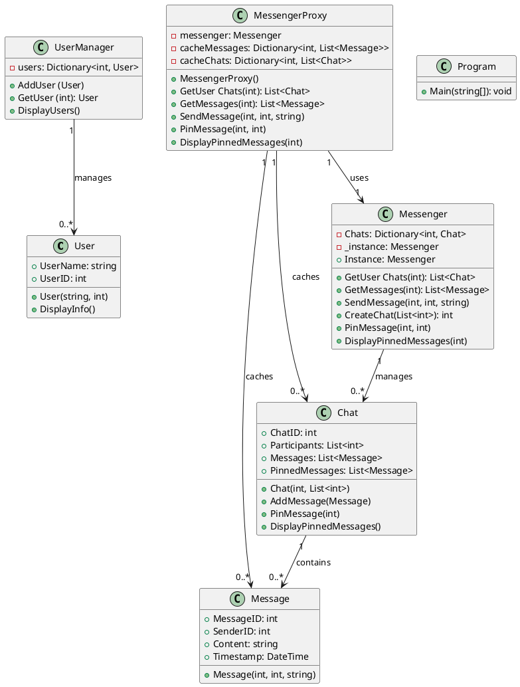

```plantuml
@startuml
class User {
    + UserName: string
    + UserID: int
    + User(string, int)
    + DisplayInfo()
}

class UserManager {
    - users: Dictionary<int, User>
    + AddUser (User)
    + GetUser (int): User
    + DisplayUsers()
}

class Message {
    + MessageID: int
    + SenderID: int
    + Content: string
    + Timestamp: DateTime
    + Message(int, int, string)
}

class Chat {
    + ChatID: int
    + Participants: List<int>
    + Messages: List<Message>
    + PinnedMessages: List<Message>
    + Chat(int, List<int>)
    + AddMessage(Message)
    + PinMessage(int)
    + DisplayPinnedMessages()
}

class Messenger {
    - Chats: Dictionary<int, Chat>
    - _instance: Messenger
    + Instance: Messenger
    + GetUser Chats(int): List<Chat>
    + GetMessages(int): List<Message>
    + SendMessage(int, int, string)
    + CreateChat(List<int>): int
    + PinMessage(int, int)
    + DisplayPinnedMessages(int)
}

class MessengerProxy {
    - messenger: Messenger
    - cacheMessages: Dictionary<int, List<Message>>
    - cacheChats: Dictionary<int, List<Chat>>
    + MessengerProxy()
    + GetUser Chats(int): List<Chat>
    + GetMessages(int): List<Message>
    + SendMessage(int, int, string)
    + PinMessage(int, int)
    + DisplayPinnedMessages(int)
}

class Program {
    + Main(string[]): void
}

UserManager "1" --> "0..*" User : manages
Messenger "1" --> "0..*" Chat : manages
Chat "1" --> "0..*" Message : contains
MessengerProxy "1" --> "1" Messenger : uses
MessengerProxy "1" --> "0..*" Chat : caches
MessengerProxy "1" --> "0..*" Message : caches

@enduml

```
