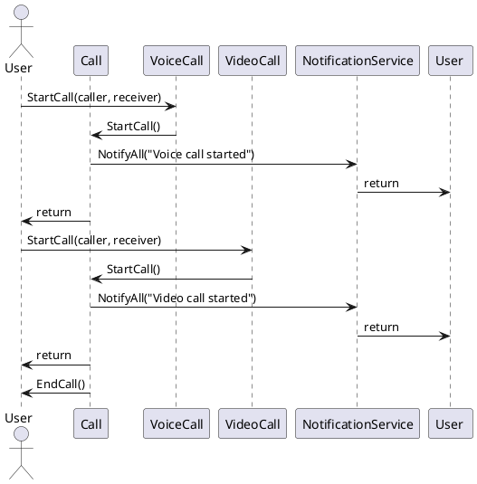

```plantuml
@startuml
actor User
participant "Call" as Call
participant "VoiceCall" as VoiceCall
participant "VideoCall" as VideoCall
participant "NotificationService" as NotificationService
participant "User " as CallUser 

User   -> VoiceCall : StartCall(caller, receiver)
VoiceCall -> Call : StartCall()
Call -> NotificationService : NotifyAll("Voice call started")
NotificationService -> CallUser  : return
Call -> User : return

User   -> VideoCall : StartCall(caller, receiver)
VideoCall -> Call : StartCall()
Call -> NotificationService : NotifyAll("Video call started")
NotificationService -> CallUser  : return
Call -> User : return

Call -> User : EndCall()
@enduml

```
