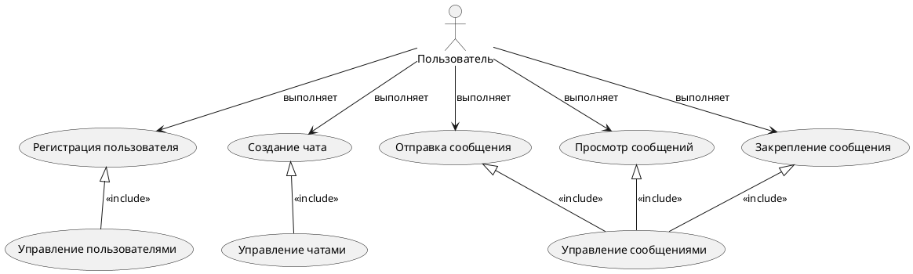

```plantuml
@startuml
actor Пользователь as User

usecase "Регистрация пользователя" as UC1
usecase "Создание чата" as UC2
usecase "Отправка сообщения" as UC3
usecase "Просмотр сообщений" as UC4
usecase "Закрепление сообщения" as UC5

User --> UC1 : выполняет
User --> UC2 : выполняет
User --> UC3 : выполняет
User --> UC4 : выполняет
User --> UC5 : выполняет

usecase "Управление пользователями" as UC_ManagerUsers
usecase "Управление чатами" as UC_ManagerChats
usecase "Управление сообщениями" as UC_ManagerMessages

UC1 <|-- UC_ManagerUsers : <<include>>
UC2 <|-- UC_ManagerChats : <<include>>
UC3 <|-- UC_ManagerMessages : <<include>>
UC4 <|-- UC_ManagerMessages : <<include>>
UC5 <|-- UC_ManagerMessages : <<include>>

@enduml

```
