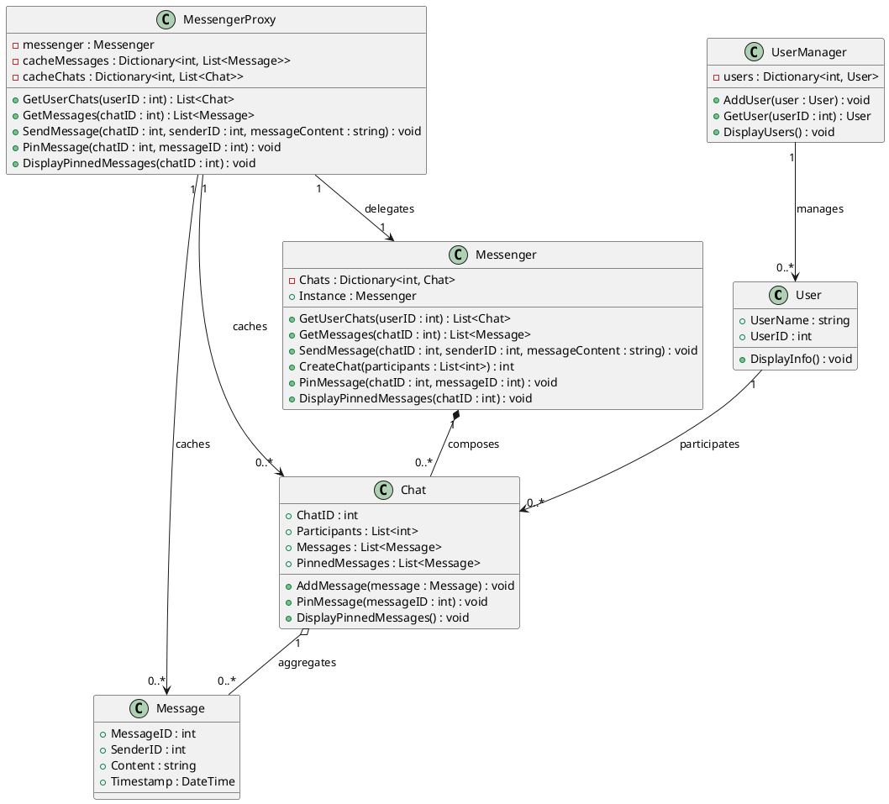

```plantuml
@startuml
class User {
    + UserName : string
    + UserID : int
    + DisplayInfo() : void
}

class UserManager {
    - users : Dictionary<int, User>
    + AddUser(user : User) : void
    + GetUser(userID : int) : User
    + DisplayUsers() : void
}

class Message {
    + MessageID : int
    + SenderID : int
    + Content : string
    + Timestamp : DateTime
}

class Chat {
    + ChatID : int
    + Participants : List<int>
    + Messages : List<Message>
    + PinnedMessages : List<Message>
    + AddMessage(message : Message) : void
    + PinMessage(messageID : int) : void
    + DisplayPinnedMessages() : void
}

class Messenger {
    - Chats : Dictionary<int, Chat>
    + Instance : Messenger
    + GetUserChats(userID : int) : List<Chat>
    + GetMessages(chatID : int) : List<Message>
    + SendMessage(chatID : int, senderID : int, messageContent : string) : void
    + CreateChat(participants : List<int>) : int
    + PinMessage(chatID : int, messageID : int) : void
    + DisplayPinnedMessages(chatID : int) : void
}

class MessengerProxy {
    - messenger : Messenger
    - cacheMessages : Dictionary<int, List<Message>>
    - cacheChats : Dictionary<int, List<Chat>>
    + GetUserChats(userID : int) : List<Chat>
    + GetMessages(chatID : int) : List<Message>
    + SendMessage(chatID : int, senderID : int, messageContent : string) : void
    + PinMessage(chatID : int, messageID : int) : void
    + DisplayPinnedMessages(chatID : int) : void
}

UserManager "1" --> "0..*" User : manages
Chat "1" o-- "0..*" Message : aggregates
Messenger "1" *-- "0..*" Chat : composes
MessengerProxy "1" --> "1" Messenger : delegates
MessengerProxy "1" --> "0..*" Chat : caches
MessengerProxy "1" --> "0..*" Message : caches
User "1" --> "0..*" Chat : participates
@enduml

```
