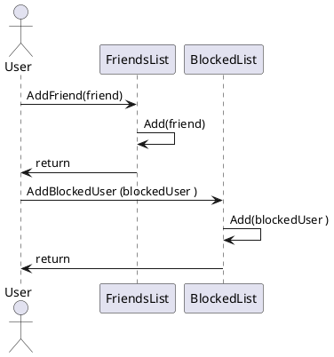

```plantuml
@startuml
actor User
participant "FriendsList" as Friends
participant "BlockedList" as Blocked

User  -> Friends : AddFriend(friend)
Friends -> Friends : Add(friend)
Friends -> User : return

User  -> Blocked : AddBlockedUser (blockedUser )
Blocked -> Blocked : Add(blockedUser )
Blocked -> User : return
@enduml

```
