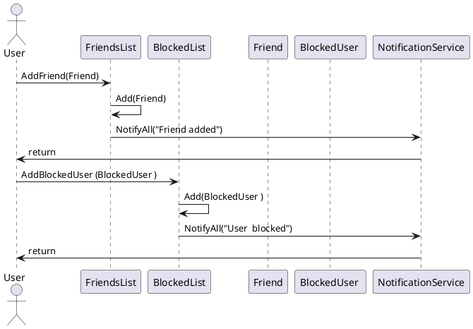

```plantuml
@startuml
actor User
participant "FriendsList" as Friends
participant "BlockedList" as Blocked
participant "Friend" as Friend
participant "BlockedUser " as BlockedUser 
participant "NotificationService" as NotificationService

User   -> Friends : AddFriend(Friend)
Friends -> Friends : Add(Friend)
Friends -> NotificationService : NotifyAll("Friend added")
NotificationService -> User : return

User   -> Blocked : AddBlockedUser (BlockedUser )
Blocked -> Blocked : Add(BlockedUser )
Blocked -> NotificationService : NotifyAll("User  blocked")
NotificationService -> User : return

```
