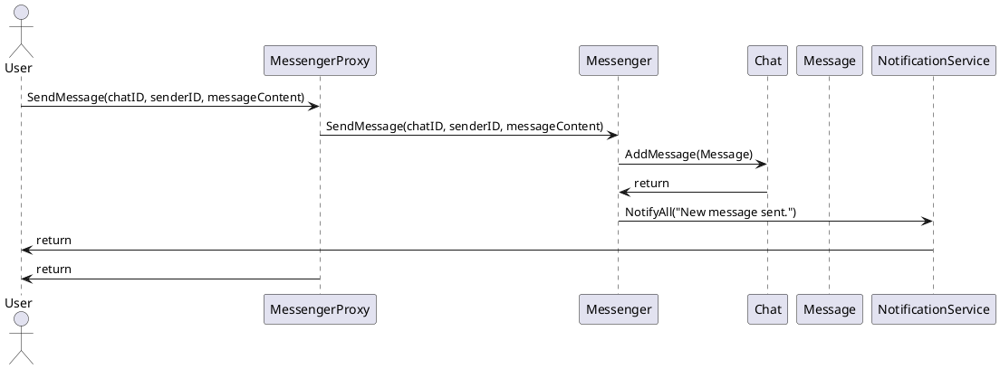

```plantuml
@startuml
actor User
participant "MessengerProxy" as Proxy
participant "Messenger" as Messenger
participant "Chat" as Chat
participant "Message" as Message
participant "NotificationService" as NotificationService

User   -> Proxy : SendMessage(chatID, senderID, messageContent)
Proxy -> Messenger : SendMessage(chatID, senderID, messageContent)
Messenger -> Chat : AddMessage(Message)
Chat -> Messenger : return
Messenger -> NotificationService : NotifyAll("New message sent.")
NotificationService -> User : return
Proxy -> User : return
@enduml

```
