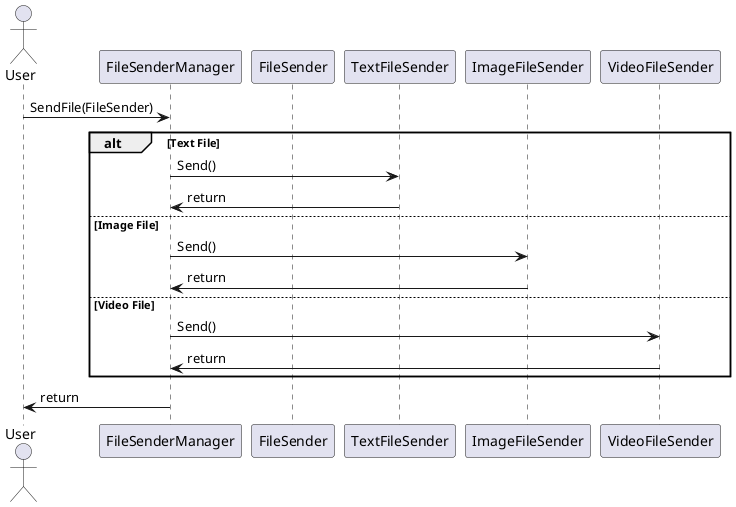

```plantuml
@startuml
actor User
participant "FileSenderManager" as FileManager
participant "FileSender" as FileSender
participant "TextFileSender" as TextFileSender
participant "ImageFileSender" as ImageFileSender
participant "VideoFileSender" as VideoFileSender

User   -> FileManager : SendFile(FileSender)
alt Text File
    FileManager -> TextFileSender : Send()
    TextFileSender -> FileManager : return
else Image File
    FileManager -> ImageFileSender : Send()
    ImageFileSender -> FileManager : return
else Video File
    FileManager -> VideoFileSender : Send()
    VideoFileSender -> FileManager : return
end
FileManager -> User : return
@enduml

```
