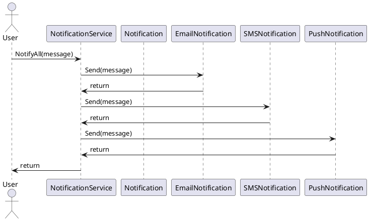

```plantuml
@startuml
actor User
participant "NotificationService" as Service
participant "Notification" as Notification
participant "EmailNotification" as Email
participant "SMSNotification" as SMS
participant "PushNotification" as Push

User   -> Service : NotifyAll(message)
Service -> Email : Send(message)
Email -> Service : return
Service -> SMS : Send(message)
SMS -> Service : return
Service -> Push : Send(message)
Push -> Service : return
Service -> User : return
@enduml

```
